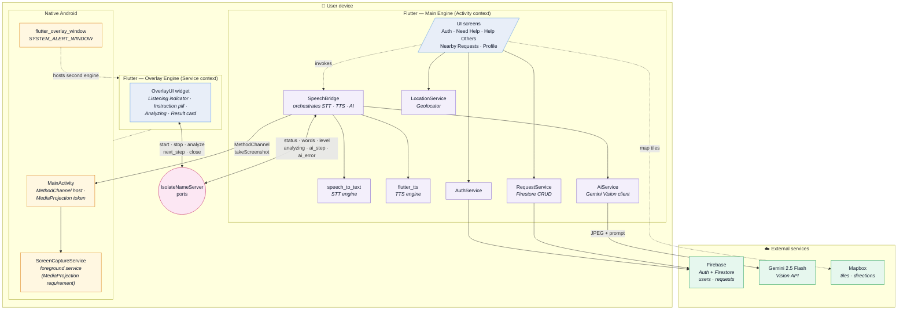
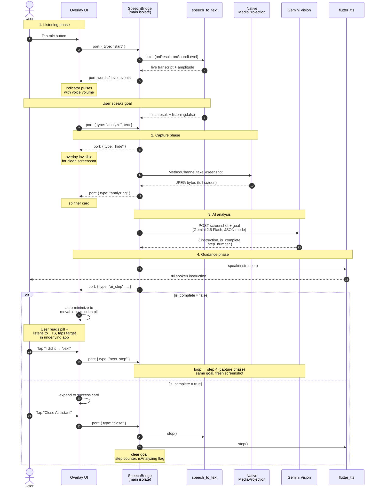

# HelpVrywhere — Architecture & Interaction Diagrams

These diagrams describe the **AI-overlay assistance flow** that helps elderly
users navigate any app on their phone.

> Both diagrams are written in [Mermaid](https://mermaid.js.org). They render
> directly in GitHub READMEs and inside any Markdown viewer with Mermaid
> support. To export PNG/SVG for slides, paste into <https://mermaid.live>
> and click **Actions → PNG / SVG**.

---

## 1. System Architecture

How the app is layered — from on-device Flutter widgets down to native
Android system services and out to the cloud APIs that power it.

### Why two Flutter engines?

The overlay needs to keep running when the user moves to another app
(WhatsApp, Settings, etc.) — that requires it to live in an Android
*Service*, which has no `Activity` context. But `speech_to_text`, `flutter_tts`,
`firebase_auth`, and most Flutter plugins **require** an Activity.

So we split the app:

| Engine | Lives in | What it can do |
|---|---|---|
| **Main** | the launcher Activity | Auth, Firestore, STT, TTS, Gemini calls, screenshots |
| **Overlay** | a foreground Service | Just renders the floating UI + handles user taps |

The two engines can't share memory, so they communicate via Dart
**`IsolateNameServer`** ports — a thin message bus carrying typed
`Map<String, dynamic>` events in both directions.

---

## 2. Interaction Flow (voice-first guidance loop)

End-to-end sequence from "user taps mic" to "user has been guided to the
right tap target". This reflects the **current** voice-first design — the
spatial bounding-box highlight was removed because vision models aren't
reliable enough at pixel coordinates and a screen-blocking overlay made it
impossible for the user to actually tap the target.

### Why hide the overlay before the screenshot?

`MediaProjection` captures **whatever is on screen at that moment**.
If the overlay is visible, Gemini sees its own card ("Analyzing
screen…") on top of the user's app — which is useless for guidance.
The bridge sends a `hide` message, waits ~250 ms for the next frame,
captures, then sends `analyzing` to bring the card back.

### Why the user-driven "I did it" loop instead of automatic detection?

We considered watching the screenshot pixels for change to auto-advance
steps. We rejected it because:

1. False positives — keyboard pop-ups, notifications, animations all
   change pixels without the user completing the step.
2. The user might still be reading or moving slowly. Forcing the loop
   forward is worse UX than letting them confirm.

The "I did it" button keeps the user in control while the overlay
stays out of their way (collapsed to a 220-px draggable pill).

---

## Tech stack at a glance

| Layer | Technology |
|---|---|
| UI framework | Flutter 3.11+ (Dart) |
| Auth & data | Firebase Auth · Cloud Firestore |
| Speech in | `speech_to_text` (Android STT) |
| Speech out | `flutter_tts` (system TTS) |
| Vision AI | Google Gemini 2.5 Flash (REST + JSON mode) |
| Maps | Mapbox Maps Flutter SDK |
| Screen capture | Android MediaProjection API |
| System overlay | `flutter_overlay_window` + `SYSTEM_ALERT_WINDOW` |
| Inter-isolate IPC | `dart:ui` `IsolateNameServer` ports |

---

## Exporting for slides / PDF

1. Open <https://mermaid.live>.
2. Paste the diagram source from the code block above.
3. **Actions → PNG** for slides, **SVG** for vector use.
4. Pick the **forest** or **base** theme and a 2–3× scale for crisp
   capstone-deck output.
